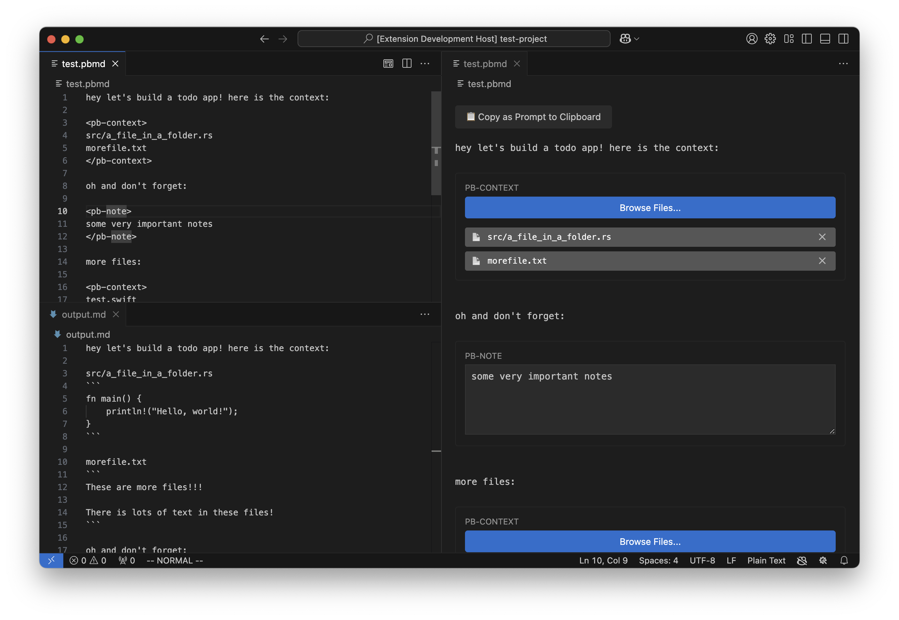

# Prompt Buddy

A VS Code extension for creating and managing prompt templates. Prompt Buddy provides a UI for working with `.pbmd` files, which are markdown files with special tags for including file contents and notes.



## Usage

Create a `.pbmd` file and use these tags:
- `<pb-context>` - List files to include in the prompt (one per line)
- `<pb-note>` - Add notes that will be included in the prompt

Example:
```
Here's my prompt:

<pb-context>
src/main.ts
config/settings.json
</pb-context>

<pb-note>
This note will be included in the final prompt
</pb-note>

More prompt text here...
```

## Features

- Side-by-side editor with file picker UI
- Automatically opens preview when you open a `.pbmd` file (can be disabled in settings)
- "Copy as prompt" button that processes the template:
  - Includes the contents of all referenced files
  - Includes all notes
  - Formats everything nicely for pasting into your favorite AI tool

## Settings

* `promptBuddy.autoOpenPreview`: Enable/disable automatic preview (default: `true`)

## Commands

- **Open Preview**: Opens the side-by-side preview of your prompt file
- **Copy as Prompt**: Processes the prompt file (including all referenced file contents) and copies it to clipboard

## Known Issues

None at this time.

## Release Notes

### 0.0.1

Initial release of Prompt Buddy:
- Side-by-side preview of prompt files
- Context file inclusion
- Notes support
- Copy to clipboard functionality